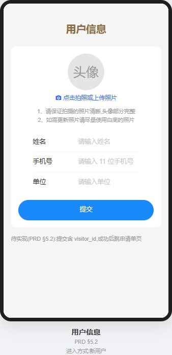
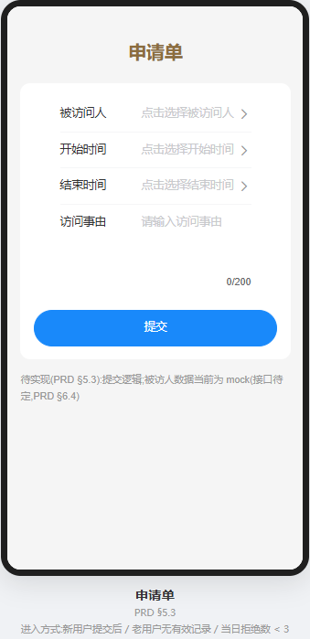
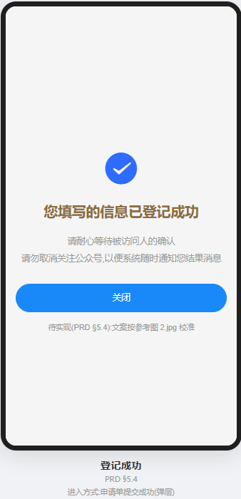
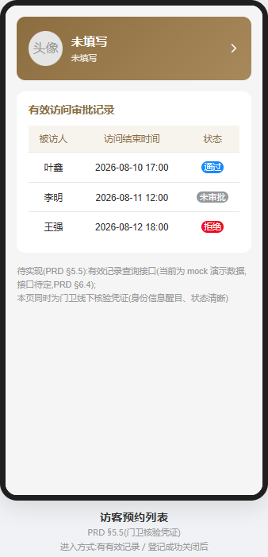
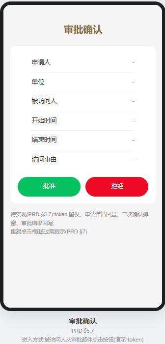

# 访客登记系统 PRD(产品需求文档)

## 1. 文档信息

| 项 | 内容 |
|---|---|
| 文档名称 | 访客登记系统 PRD |
| 版本 | v1.1 |
| 编写日期 | 2026-08-10 |
| 编写依据 | `discard_业务流程.md`(业务流程梳理,已弃用)、`pic/股份_访客系统/` 参考页面截图(0.jpg、1.jpg、2.jpg、6.jpg) |
| 适用范围 | 访客预约 H5 前端 + 邮件审批环节 + 门卫线下人工核验 |
| 变更记录 | v1.1:新增门卫角色(线下人工核验,见 §3.1、§5.5)<br>v1.2(2026-08-13):移除被访人查询结果中的 SAP 号字段(§5.3、§6.3);确认头像照片**必填**(§5.2、§5.6);确认申请单页**不保留**「个人信息保护政策」勾选(§5.3);确认被访人数据来自若依系统用户表 sys_user 扩展,邮箱取 `sys_user.email`(§6.3);确认审批邮件由后端发送、审批链接 token 采用 JWT(§5.7、§6.4);接口契约见 `docs/03_接口契约.md`<br>v1.3(2026-08-13):确认 §9.2 待确认项 5~8——审批不做二次确认弹窗(§5.7);列表空态不展示文案(§5.5);顶部用户信息区仅含「我的信息」入口(§5.5);防伪措施采用当前时间戳,不做水印与二维码(§5.5) |
| 技术背景 | 前端 Vue 3 + Vite;后端若依 RuoYi(Spring Boot 4);接口契约已定义,见 `docs/03_接口契约.md` |

## 2. 项目概述

### 2.1 项目背景

访客到访需提前预约登记。访客通过扫码进入 H5 页面,填写个人信息并提交访问申请,由被访问人通过邮件完成审批,实现访客预约的全流程线上化。

### 2.2 项目目标

- 为访客提供便捷的预约登记入口(扫码即用,无需安装)
- 为被访问人提供邮件审批方式,及时处理访客申请
- 访客可查看自己当前有效的访问审批记录及状态

### 2.3 项目范围

- **本 PRD 覆盖**:访客侧 H5(用户信息、申请单、登记成功、访客预约列表、我的信息)+ 被访问人侧邮件审批确认页 + 门卫线下人工核验环节
- **不在本 PRD 范围**:后台管理端、被访人数据管理系统、审批邮件的邮件服务器配置、审批动作的 PC 端后台
- **门卫角色说明**:门卫为**线下人工核验角色**,不进入系统、无独立页面、无需登录、不产生放行记录;核验依据为访客手机上的《访客预约列表》页(见 §5.5)

## 3. 用户角色与术语

### 3.1 用户角色

| 角色 | 说明 |
|---|---|
| 访客(申请人) | 扫码进入 H5,填写个人信息、提交访问申请、查看审批记录 |
| 被访问人(审批人) | 收到审批邮件,通过邮件按钮进入审批确认页,对申请单做出通过/拒绝决定 |
| 门卫(线下核验) | 不进入系统。访客到厂区门口出示手机《访客预约列表》页,门卫核对访客身份及审批记录状态,人工判断是否放行;无需登录,系统不记录放行动作 |

### 3.2 术语表

| 术语 | 定义 |
|---|---|
| visitor_id | 访客唯一标识。由前端自动生成并存储在 localStorage;新老用户判断依据 |
| 申请单 | 访客提交的一次访问申请记录 |
| 审批记录 | 申请单被审批后产生的记录,状态含未审批、通过、拒绝 |
| 有效记录 | 当前日期落在申请单「开始时间 ~ 结束时间」范围内的审批记录 |
| 拒绝次数 | 同一访客**当天**被拒绝的审批记录总数,按自然日统计,次日清零 |

## 4. 整体业务流程

### 4.1 主流程

```
访客扫码(获得预约入口网址)
        │
        ▼
┌─ 新老用户判断 ──────────────────────────────┐
│  localStorage 中无 visitor_id ──→ 新用户      │
│  localStorage 中有 visitor_id               │
│    → 提交后台查询 → 未查到 ──→ 新用户         │
│    → 查到 ──→ 老用户                         │
└─────────────────────────────────────────────┘
        │
        ├── 新用户:自动生成 visitor_id,跳转《用户信息》页
        │      ├─ 填写姓名/手机号/单位/头像,提交(含 visitor_id)
        │      └─ 提交成功 → 跳转《申请单》页
        │
        └── 老用户:判断当前日期是否存在有效审批记录
               ├─ 无 → 跳转《申请单》页
               └─ 有 → 按记录状态:
                      ├─ 未审批/通过 → 跳转《访客预约列表》页
                      └─ 拒绝 →
                             ├─ 当日拒绝数 < 3 → 跳转《申请单》页
                             │     (提醒:存在审批人拒绝情况,申请次数剩余:3 - 当日拒绝数)
                             └─ 当日拒绝数 ≥ 3 → 跳转《访客预约列表》页
                                   (提醒:审批人拒绝近期访问,谢谢。)

《申请单》页
  ├─ 被访问人:弹窗搜索选择(不可手输)
  ├─ 开始时间/结束时间:日期选择控件
  ├─ 访问事由
  └─ 提交成功 → 弹出《登记成功》页
        └─ 点击「关闭」→ 跳转《访客预约列表》页

(后台)申请单提交成功后 → 系统发送审批邮件至被访问人邮箱
  └─ 被访问人在邮件中点击「审批」/「拒绝」按钮
        └─ 跳转《审批确认》页(展示申请详情)
              ├─ 确认「批准」→ 状态:未审批 → 通过
              └─ 确认「拒绝」→ 状态:未审批 → 拒绝

门卫核验环节(线下人工,访客到厂区门口时):
  访客出示手机《访客预约列表》页
    ├─ 门卫核对:页面头像/姓名/单位 与访客本人是否一致
    └─ 门卫查看有效审批记录状态,人工判断:
          ├─ 状态为「通过」→ 放行进入厂区
          ├─ 状态为「未审批」→ 不放行,提示访客等待被访人审批
          └─ 状态为「拒绝」/ 无有效记录 → 不放行
```

### 4.2 页面流转关系

| 页面 | 进入方式 | 离开去向 |
|---|---|---|
| 入口(扫码) | 扫码访问预约网址 | 按新老用户判断分流 |
| 用户信息页 | 新用户 | 提交成功后 → 申请单页 |
| 申请单页 | 新用户提交信息后 / 老用户无有效记录 / 当日拒绝数 < 3 | 提交成功后 → 登记成功页 |
| 登记成功页 | 申请单提交成功(弹层) | 点击关闭 → 访客预约列表页 |
| 访客预约列表页 | 有有效记录(未审批/通过)/ 当日拒绝数 ≥ 3 / 登记成功关闭后 | 顶部用户信息区 → 我的信息页 |
| 我的信息页 | 列表页顶部用户信息区 | 提交成功后 → 返回列表页 |
| 审批确认页 | 被访问人从审批邮件点击按钮 | 确认后 → 审批完成提示 |

## 5. 页面功能需求

### 5.1 入口与新老用户判断

**功能说明**:访客通过扫码进入 H5,系统自动判断新老用户并分流。

| 编号 | 需求点 | 说明 |
|---|---|---|
| 5.1.1 | visitor_id 读取 | 读取浏览器 localStorage 中的 visitor_id |
| 5.1.2 | 新用户判断 | localStorage 无 visitor_id,或提交后台查询后未查到对应用户信息,均判定为新用户 |
| 5.1.3 | visitor_id 生成 | 判定为新用户时,前端自动生成唯一 visitor_id(UUID 格式,建议)并存入 localStorage |
| 5.1.4 | 老用户判断 | localStorage 有 visitor_id 且后台查询到对应用户信息,判定为老用户;查询到的用户信息(姓名、手机号、单位、头像)反馈至前端 |
| 5.1.5 | 分流规则 | 新用户 → 用户信息页;老用户按 §4.1 分支逻辑跳转 |

**分支判断规则**(老用户,按当前日期判断是否存在有效审批记录):

| 情况 | 跳转页面 | 附加行为 |
|---|---|---|
| 无有效审批记录 | 申请单页 | — |
| 有有效记录,状态为未审批/通过 | 访客预约列表页 | — |
| 有有效记录,状态为拒绝,当日拒绝数 < 3 | 申请单页 | 弹窗提醒「存在审批人拒绝情况,申请次数剩余:**N** 次」(N = 3 - 当日拒绝数);拒绝数 ≥ 3 时禁止提交申请 |
| 有有效记录,状态为拒绝,当日拒绝数 ≥ 3 | 访客预约列表页 | 弹窗提醒「审批人拒绝近期访问,谢谢。」 |

### 5.2 用户信息页

**参考**:`pic/股份_访客系统/0.jpg`。

**功能说明**:新用户首次进入时填写个人基础信息。

**页面字段**:

| 字段 | 类型 | 必填 | 校验规则 |
|---|---|---|---|
| 姓名 | 文本输入 | 是 | 非空;长度 ≤ 20 字符 |
| 手机号 | 文本输入(数字键盘) | 是 | 中国大陆 11 位手机号格式(以 1 开头,第二位 3-9) |
| 单位 | 文本输入 | 是 | 非空 |
| 头像照片 | 图片上传(拍照/相册) | 是 | 上传后裁剪/预览;上传提示参照 0.jpg(照片清晰、头像完整、尽量白底) |

**交互说明**:
1. 提交前按上述规则校验(含头像必填),不通过时在对应字段下方显示错误提示(参照参考图错误态样式)
2. 提交数据包含新生成的 visitor_id 及用户信息,提交成功后跳转《申请单》页
3. 提交失败(网络异常等):提示错误并保留已填内容,支持重试

### 5.3 申请单页

**参考**:`pic/股份_访客系统/1.jpg`(表单)、`pic/股份_访客系统/3.jpg`(被访人查询弹窗)、`pic/股份_访客系统/5.jpg`(日期时间选择控件)。

**功能说明**:访客填写访问申请信息并提交。

**页面字段**:

| 字段 | 类型 | 必填 | 交互约束 |
|---|---|---|---|
| 被访问人 | 文本输入(只读) | 是 | **只能通过弹窗选择填入,禁止手工输入**;点击输入框弹出被访人查询弹窗 |
| 开始时间 | 日期时间选择控件 | 是 | 点击输入框弹出选择控件;不能早于当前日期 |
| 结束时间 | 日期时间选择控件 | 是 | 点击输入框弹出选择控件;必须晚于开始时间 |
| 访问事由 | 多行文本域 | 是 | 非空;长度 ≤ 200 字符 |

**被访人查询弹窗**(模态方式):
1. 名字输入框:输入被访人姓名关键字
2. 搜索按钮:点击后发起查询
3. 查询结果列表:每行含 radio 单选按钮、部门、姓名(参考 3.jpg)
4. 确认按钮:完成选择,将被访人姓名自动填入「被访问人」输入框,关闭弹窗
5. 搜索结果为空时展示空态提示,支持重新输入搜索

**日期时间选择控件**:
- 参照 5.jpg 的滚轮式选择(年/月/日/时/分),提供「取消/确认」操作
- 校验:开始时间不能早于当前日期;结束时间必须晚于开始时间,不满足时提示

**提交逻辑**:
1. 四项均必填,未填写或校验不通过时阻止提交并提示(提交按钮置灰禁用,参照 1.jpg 交互)
2. 提交成功后弹出《登记成功》页
3. 后台同时触发向被访问人邮箱发送审批邮件(邮件内容见 §5.7)

**已确认(2026-08-13)**:申请单页**不保留**「我已阅读并同意《个人信息保护政策》」勾选,提交按钮不依赖勾选状态。

### 5.4 登记成功页

**参考**:`pic/股份_访客系统/2.jpg`。

**功能说明**:申请单提交成功后展示的反馈页(以弹层/新页面形式呈现)。

**页面内容**:
- 成功提示:登记成功信息 + 「请耐心等待被访人的确认」等引导文案(参照 2.jpg)
- 「关闭」按钮:点击后跳转《访客预约列表》页

### 5.5 访客预约列表页

**参考**:`pic/股份_访客系统/6.jpg`。

**功能说明**:展示访客个人信息与当前**有效**的访问审批记录。

**页面内容**:
1. 顶部用户信息区(参照 6.jpg):头像、姓名、单位;点击该区域跳转《我的信息》页
2. 有效访问审批记录列表(仅展示**有效记录**,即当前日期在申请的开始~结束时间范围内的记录):

| 字段 | 说明 |
|---|---|
| 被访人 | 申请的被访问人姓名 |
| 访问结束时间 | 申请的结束时间 |
| 状态 | 标签展示:未审批 / 通过 / 拒绝(参照 6.jpg 蓝色圆角标签样式) |

**空态**:无有效记录时仅展示空状态图标,**不展示文案**(已确认)。

**门卫核验凭证要求**(该页面同时作为门卫线下核验的依据):
1. 身份信息(头像、姓名、单位)在页面顶部醒目展示,便于门卫与访客本人核对,防止冒用
2. 审批记录状态(未审批/通过/拒绝)以清晰的状态标签呈现,门卫仅对状态为「通过」的记录放行
3. 页面仅展示有效记录,即访客到达门口时恰好处于核验窗口期,门卫无需自行判断时间有效性
4. **防伪措施(已确认)**:页面实时展示**当前时间戳**(日期+时间,前端本地时间),门卫对照当前时刻判断页面是否为截图冒用;不做水印与二维码

### 5.6 我的信息页(修改)

**参考**:`pic/股份_访客系统/0.jpg`。

**功能说明**:老用户从列表页顶部用户信息区进入,修改个人基础信息。

**页面字段**:同 §5.2 用户信息页(姓名、手机号、单位、头像照片)。

**交互说明**:
1. 进入页面时回显当前用户信息
2. 修改后提交,校验规则同 §5.2;提交成功返回《访客预约列表》页并更新展示
3. 头像更新交互参照 0.jpg(拍照提示、白底建议)

### 5.7 审批确认页(被访问人侧)

**功能说明**:被访问人从审批邮件点击「审批」或「拒绝」按钮后进入的 H5 页面,确认审批操作。

**入口**:审批邮件内「审批」/「拒绝」按钮 → 携带申请单标识(token)跳转本页。

**页面内容**:
1. 申请详情展示:申请人姓名、单位、被访问人、开始时间、结束时间、访问事由
2. 操作区:「批准」/「拒绝」两个按钮,点击后直接回写审批结果(已确认:**不做二次确认弹窗**)
3. 确认后回写审批结果,申请单状态:未审批 → 通过 / 拒绝

**状态与异常处理**:
| 场景 | 处理 |
|---|---|
| 申请单已审批(重复点击链接) | **只能审批一次**:已审批的申请单通过邮件链接再次进入时,直接提示「该申请单已完成审批」,**不展示申请详情审批操作区**;后端条件更新(`WHERE status='0'`)兜底,杜绝重复审批 |
| 链接无效/token 校验失败 | 提示链接无效或已过期 |
| 审批确认页权限 | 审批链接 token 鉴权(JWT),已确认(见 §9.2、`docs/03_接口契约.md` §5.1) |

## 6. 数据需求

> **说明**:本节以数据字典形式描述各实体所需数据字段,具体接口契约(URL、参数、响应格式)及表结构见 `docs/03_接口契约.md`。

### 6.1 访客信息(visitor)

| 字段 | 类型 | 说明 |
|---|---|---|
| visitor_id | 字符串(UUID) | 唯一标识,新用户由前端自动生成 |
| 姓名 | 字符串 | 必填 |
| 手机号 | 字符串(11 位) | 必填 |
| 单位 | 字符串 | 必填 |
| 头像照片 | 图片/URL | 必填 |
| 注册时间 | 时间 | 系统记录 |

### 6.2 申请单(application)

| 字段 | 类型 | 说明 |
|---|---|---|
| 申请单号 | 字符串 | 唯一标识 |
| visitor_id | 字符串 | 所属访客 |
| 被访问人 | 字符串/被访人标识 | 来自被访人查询选择 |
| 开始时间 | 时间 | 不能早于当前日期 |
| 结束时间 | 时间 | 必须晚于开始时间 |
| 访问事由 | 字符串 | 必填 |
| 状态 | 枚举:未审批/通过/拒绝 | 默认未审批 |
| 提交时间 | 时间 | 系统记录 |
| 审批时间 | 时间 | 审批完成时记录 |

### 6.3 被访人数据(来源于被访人查询接口)

**已确认(2026-08-13)**:被访人数据来自**若依系统用户表 `sys_user` 扩展**(查询 `status='0'` 且 `del_flag='0'` 的用户,部门取关联 `sys_dept.dept_name`),邮箱取 `sys_user.email` 用于发送审批邮件。

| 字段 | 类型 | 说明 |
|---|---|---|
| 部门 | 字符串 | 查询结果展示(sys_dept.dept_name) |
| 姓名 | 字符串 | 查询结果展示;选中后回填申请单(sys_user.nick_name) |
| 邮箱 | 字符串 | 用于发送审批邮件(sys_user.email) |

### 6.4 接口需求清单

> **已确认(2026-08-13)**:接口契约已定义,见 `docs/03_接口契约.md`。

| 接口能力 | 说明 |
|---|---|
| 用户信息查询 | 按 visitor_id 查询用户信息,用于老用户判断 |
| 用户信息提交/更新 | 新用户注册、老用户修改 |
| 头像上传 | 访客匿名上传头像图片 |
| 被访人查询 | 按姓名关键字搜索被访人(sys_user) |
| 申请单提交 | 提交访问申请,成功后后端发送审批邮件 |
| 审批记录查询 | 按 visitor_id 查询有效审批记录(含状态、当日拒绝数统计) |
| 审批结果回写 | 审批确认页提交审批结果(JWT token 鉴权) |

## 7. 异常与边界处理

| 场景 | 处理方式 |
|---|---|
| 后台查询/提交失败(网络异常) | 提示错误信息,保留用户已填内容,支持重试 |
| 被访人搜索结果为空 | 展示空态提示,支持更换关键字重新搜索 |
| 审批邮件链接重复点击 | 提示「该申请单已完成审批」 |
| 审批链接无效/过期 | 提示链接无效 |
| 当日拒绝数达到 3 次后尝试申请 | 禁止提交并提示「审批人拒绝近期访问,谢谢。」(入口拦截) |
| 提交申请时后台生成失败 | 提示提交失败,请重试;不丢失已填内容 |
| 门卫核验:访客页面无有效记录或状态非「通过」 | 不放行;状态为「未审批」时引导访客等待审批完成后再进厂 |

## 8. 非功能需求

| 类别 | 需求 |
|---|---|
| 终端适配 | 移动端 H5,适配主流手机屏幕(320px~430px 宽);扫码场景主要在微信内置浏览器,需重点兼容 |
| 性能 | 首屏可交互时间 ≤ 3s(参考目标);图片上传有压缩/尺寸限制 |
| 安全 | visitor_id 仅前端生成与存储(localStorage),后台校验兜底;审批链接需携带不可预测的 token |
| 隐私 | 涉及访客个人信息(姓名、手机号、证件照片),须按《个人信息保护政策》(待定)执行 |

## 9. 附录

### 9.1 参考图映射表

| PRD 页面 | 参考截图 |
|---|---|
| 用户信息页(表单) / 我的信息页 | `pic/股份_访客系统/0.jpg` |
| 申请单页(表单) | `pic/股份_访客系统/1.jpg` |
| 被访人查询弹窗 | `pic/股份_访客系统/3.jpg` |
| 日期时间选择控件 | `pic/股份_访客系统/5.jpg` |
| 登记成功页 | `pic/股份_访客系统/2.jpg` |
| 访客预约列表页 | `pic/股份_访客系统/6.jpg` |

    

### 9.2 待确认事项清单

| 编号 | 事项 | 影响 | 状态 |
|---|---|---|---|
| 1 | 头像照片是否必填 | 用户信息页校验规则 | **已确认(2026-08-13):必填** |
| 2 | 申请单页是否保留「个人信息保护政策」勾选及政策文本 | 申请单页交互与提交逻辑 | **已确认(2026-08-13):不保留** |
| 3 | 被访人邮箱数据来源(查询接口是否含邮箱字段) | 审批邮件发送 | **已确认(2026-08-13):sys_user.email** |
| 4 | 审批邮件内容模板、邮件按钮跳转链接参数与 token 鉴权方式 | 邮件审批环节 | **部分确认(2026-08-13):token 采用 JWT;邮件模板文案待定** |
| 5 | 审批确认页「批准/拒绝」是否需二次确认弹窗 | 审批确认页交互 | **已确认(2026-08-13):不需要,点击直接回写** |
| 6 | 列表页空态文案 | 列表页展示 | **已确认(2026-08-13):不展示文案,仅空状态图标** |
| 7 | 访客预约列表页顶部用户信息区是否含「我的信息」编辑入口以外的其他操作 | 列表页交互 | **已确认(2026-08-13):不含,仅「我的信息」编辑入口** |
| 8 | 是否需要凭证防伪措施(页面水印/当前时间戳/二维码供门卫扫码核验),防止截图冒用 | 门卫核验可靠性 | **已确认(2026-08-13):采用当前时间戳,不做水印与二维码** |
