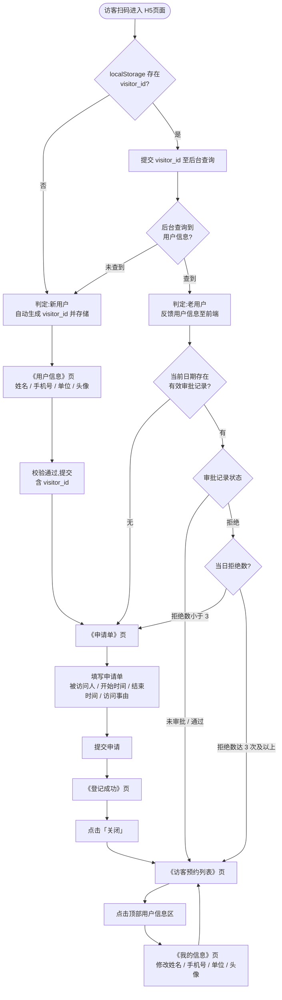
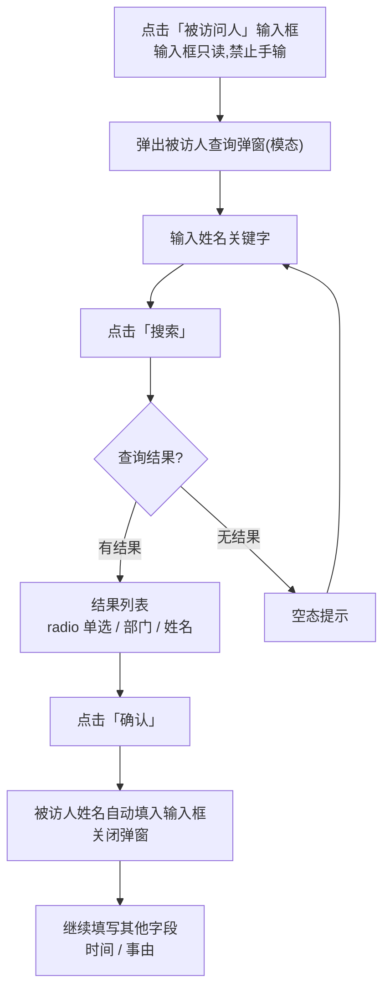
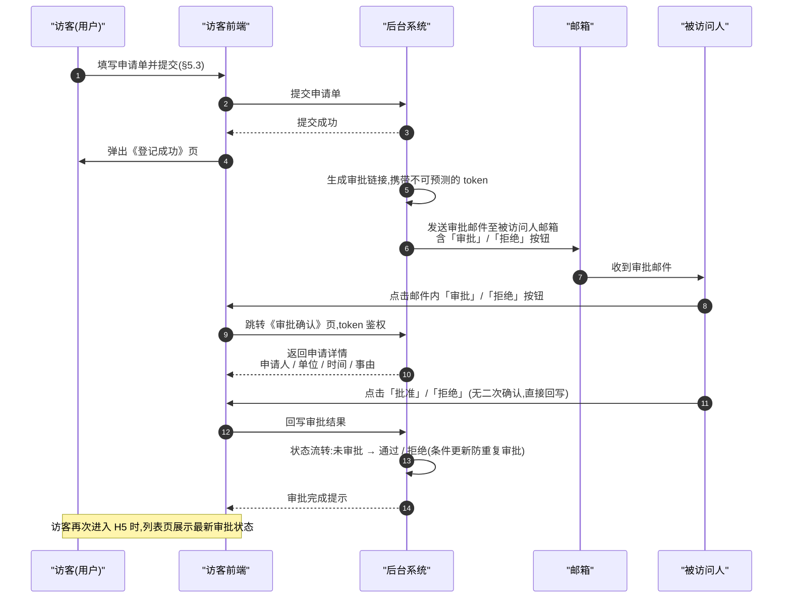
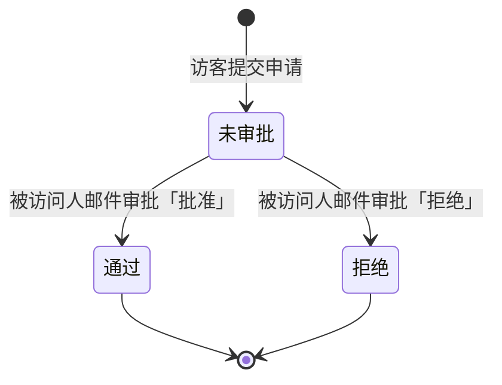
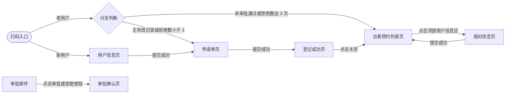
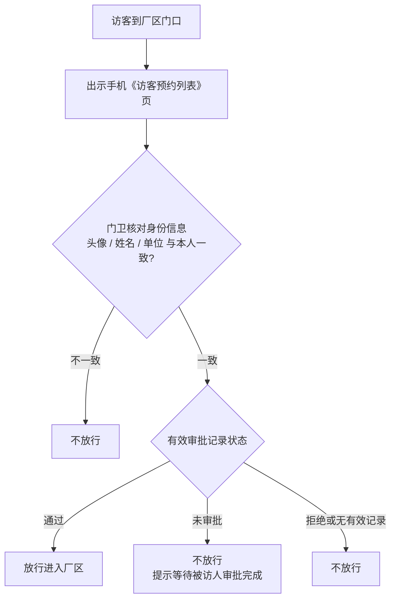

# 访客登记系统业务流程图

> 来源:[01_PRD.md](01_PRD.md) §4 整体业务流程、§5 页面功能需求。图中引用编号对应 PRD 章节。

## 1. 主业务流程图(访客侧)

**分支提醒说明**(对应 PRD §5.1.5):

| 场景 | 跳转 | 提醒 |
|---|---|---|
| 拒绝数 < 3 再次进入申请单 | 《申请单》页 | 弹窗提醒「存在审批人拒绝情况,申请次数剩余:**N** 次」(N = 3 - 当日拒绝数) |
| 拒绝数 ≥ 3 | 《访客预约列表》页 | 弹窗提醒「审批人拒绝近期访问,谢谢。」 |
| 拒绝数 ≥ 3 时尝试提交申请 | 入口拦截 | 禁止提交,提示「审批人拒绝近期访问,谢谢。」 |

## 2. 被访人选择流程(申请单页内)

## 3. 邮件审批时序图

## 4. 审批状态流转图

## 5. 页面流转关系(PRD §4.2)

## 6. 门卫核验流程(线下人工,访客到厂区门口时)

**核验判定说明**:

| 核验结果 | 门卫动作 |
|---|---|
| 身份一致,且记录状态为「通过」 | 放行进入厂区 |
| 身份一致,状态为「未审批」 | 不放行,提示访客等待审批完成 |
| 身份一致,状态为「拒绝」或页面无有效记录 | 不放行 |
| 身份与页面不一致(疑似冒用) | 不放行 |
